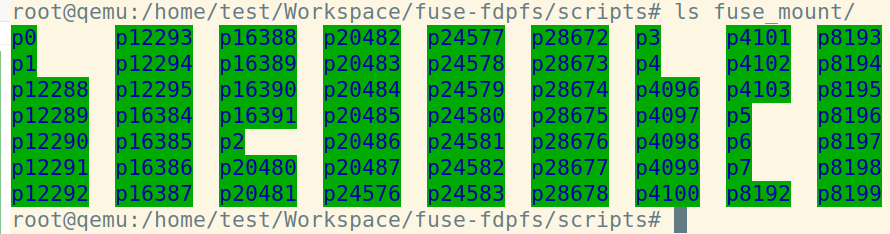

# fuse-fdpfs

FDPFS is a File System in Userspace (FUSE) - based file system that expose FDP SSD's chariteristics to allow ease of use data placement on FDP-enabled SSDs.

# How to set up FDPFS

## Step 0 Clone the repository

```shell
git clone https://github.com/pingxiang-chen/fuse-fdpfs.git
```

## Step 1 Install libfuse 3.16.2

```shell
wget https://github.com/libfuse/libfuse/releases/download/fuse-3.16.2/fuse-3.16.2.tar.gz
```

```shell
tar xzf fuse-3.16.2.tar.gz
```

Follow the <a href="https://github.com/libfuse/libfuse" target="_blank">README</a> to install libfuse 3.16.2.

## Step 2 Install libnvme 1.8

```shell
wget https://github.com/linux-nvme/libnvme/archive/refs/tags/v1.8.zip
```

```shell
tar xzf v1.8.zip
```

Follow the <a href="https://github.com/linux-nvme/libnvme" target="_blank">README</a> to install libnvme 3.16.2.


## Step 3 Install and Compile Linux 6.7.9

```shell
wget https://git.kernel.org/pub/scm/linux/kernel/git/stable/linux.git/snapshot/linux-6.7.9.tar.gz
```

```shell
tar xvf linux-6.7.9.tar.gz
```
<a href="https://phoenixnap.com/kb/build-linux-kernel" target="_blank">Build and compile </a> linux kernel 6.7.9.

After installed the kernel, install linux headers to your computer, for example:

```shell
sudo make headers_install INSTALL_HDR_PATH=/usr
```

## Step 4 Go to FDPFS source code folder and compile FDPFS
```shell
cd fuse-fdpfs && make
```

Switch to superuser

```shell
sudo su
```

Mount FDPFS on FDP SSD.

```shell
cd scripts && ./mount_fdpfs.sh
```

Open another terminal, and switch to sudo user as well, you should be able to see FDPFS exposes the placment identifier as directorys 

```shell
ls fuse_mount
```

You should be able to see the following:
